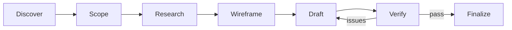
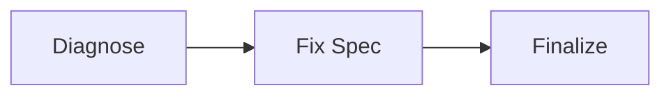

# claude-bts

**B**ulletproof **T**echnical **S**pecification — catches spec errors before they become debugging sessions.

[](https://github.com/imtemp-dev/claude-bts/actions/workflows/ci.yml)
[](https://github.com/imtemp-dev/claude-bts/releases)
[](LICENSE)
[](https://go.dev)

[한국어](README.ko.md) | [中文](README.zh.md) | [日本語](README.ja.md) | [For AI Agents](llms.txt)

## Why

You already do the right things — reminding AI of the architecture, asking for reviews, checking edge cases. But doing it manually means some sessions you're thorough and some you're not. Mistakes in the plan slip through to code, where they cost builds and debugging instead of a text edit. And once AI is deep in implementation, it loses sight of what the whole system should look like.

bts automates what you're already doing:

- **Isolated verification** — a separate AI instance reviews the spec without sharing the blind spots of the session that wrote it
- **State tracking** — issues found during verification persist across sessions and compactions, so nothing gets lost
- **Completion gates** — specs can't finalize without passing verification; code can't complete without tests, review, and deviation docs
- **Big picture first** — intent, scope, and wireframe are established before drafting begins, giving every later step a destination to refer back to

The core idea: **fix errors in documents, not in code.** A spec edit is free. A code fix is a build-test-debug cycle.

## Quick Start

```bash
brew tap imtemp-dev/tap && brew install bts   # or: curl -fsSL https://raw.githubusercontent.com/imtemp-dev/claude-bts/main/install.sh | bash
cd your-project && bts init . && claude
```

Then inside Claude Code:

```bash
/bts-recipe-blueprint add OAuth2 authentication    # full spec → code → tests
/bts-recipe-fix login bcrypt hash comparison fails  # diagnose → fix → test
/bts-recipe-debug session drops after 5 minutes     # 6-perspective analysis → fix
```

## How It Works

Every recipe has a **spec phase** (iterate on documents) and an **implementation phase** (generate and validate code). Errors caught in spec cost a text edit. Errors caught in code cost a build cycle.

### Spec Phase (per recipe type)

**Blueprint** — full spec for new features:



**Fix** / **Debug** — lightweight:



**Design** / **Analyze** — spec only, no code:


### Implementation Phase (shared)


## Models

Core quality gates (verify, audit, simulate, review) use your **session model** in a **fork context** — a separate AI instance that doesn't share the conversation history. Pattern-based checks (cross-check, sync-check, security review) use Sonnet.

Override any agent model in `.bts/config/settings.yaml`:

```yaml
agents:
  # verifier: sonnet         # default: session model
  # auditor: sonnet          # default: session model
  reviewer_security: sonnet  # pattern-based
```

## Recipes

| Recipe | Purpose | Output |
|--------|---------|--------|
| `/bts-recipe-blueprint` | Full implementation spec | Level 3 spec → code → tests |
| `/bts-recipe-design` | Design a feature | Level 2 design doc |
| `/bts-recipe-analyze` | Understand existing system | Level 1 analysis doc |
| `/bts-recipe-fix` | Known bug fix | Fix spec → code → tests |
| `/bts-recipe-debug` | Unknown bug investigation | 6-perspective analysis → fix |

## CLI

```
bts init [dir]              Initialize project
bts doctor [recipe-id]      Health check
bts recipe list|status|create|cancel   Manage recipes
bts recipe log <id>         Record action / phase
bts stats [recipe-id]       Metrics and cost (--json, --csv)
bts graph [recipe-id]       Document relationship graph
bts verify <file>           Check document consistency
bts validate [recipe-id]    JSON schema check
bts sync-check [recipe-id]  Verify document sync
bts update                  Update templates
bts version                 Show versions
```

## Architecture

**Go binary** — single statically-linked binary (~5ms startup), zero runtime dependencies. Manages state, validates completion, deploys templates, tracks metrics.

**Claude Code integration** — 21 skills, 8 lifecycle hooks, 6 rules. Verification always runs in separate agent contexts.

**File structure:**

```
.bts/
├── specs/     # git tracked — recipes, vision, roadmap
└── local/     # gitignored — metrics, work-state
```

## Requirements

- [Claude Code](https://docs.anthropic.com/en/docs/claude-code)
- Go 1.22+ ([install](https://go.dev/dl/))
- macOS, Linux (Windows via WSL)

## Contributing

```bash
git clone https://github.com/imtemp-dev/claude-bts.git && cd claude-bts
make install && go test -race ./...
```

[Open an issue](https://github.com/imtemp-dev/claude-bts/issues) for bugs or feature requests.

## License

MIT
