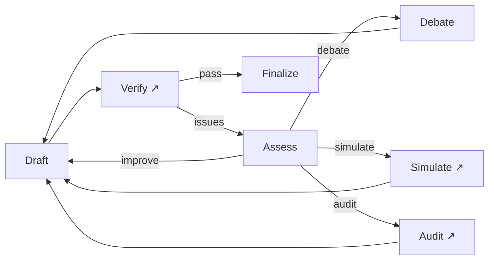
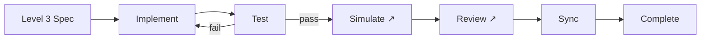

# jig

**Build the jig before you cut** — catches spec errors before they become debugging sessions.

[](https://github.com/imtemp-dev/jig/actions/workflows/ci.yml)
[](https://github.com/imtemp-dev/jig/releases)
[](LICENSE)
[](https://go.dev)

[한국어](README.ko.md) | [中文](README.zh.md) | [日本語](README.ja.md) | [For AI Agents](llms.txt)

## Why

You already do the right things — reminding AI of the architecture, asking for reviews, checking edge cases. But doing it manually means some sessions you're thorough and some you're not. Mistakes in the plan slip through to code, where they cost builds and debugging instead of a text edit. And once AI is deep in implementation, it loses sight of what the whole system should look like.

jig automates what you're already doing:

- **Isolated verification** — a separate AI instance reviews the spec without sharing the blind spots of the session that wrote it
- **State tracking** — issues found during verification persist across sessions and compactions, so nothing gets lost
- **Completion gates** — specs can't finalize without passing verification; code can't complete without tests, review, and deviation docs
- **Big picture first** — intent, scope, and wireframe are established before drafting begins, giving every later step a destination to refer back to

The core idea: **fix errors in documents, not in code.** A spec edit is free. A code fix is a build-test-debug cycle.

## Install

```bash
# Homebrew (macOS / Linux)
brew tap imtemp-dev/tap && brew install jig

# Or one-line install
curl -fsSL https://raw.githubusercontent.com/imtemp-dev/jig/main/install.sh | bash

# Or build from source
git clone https://github.com/imtemp-dev/jig.git && cd jig && make install
```

```bash
# Update
brew upgrade jig              # or: jig update (templates only)

# Uninstall
brew uninstall jig            # binary only — .jig/ and .claude/ stay in your project
```

## Upgrading from bts

jig was previously called bts. Upgrading the binary is the whole migration —
the first `jig` command in a project adopts what is already there:

```bash
brew uninstall bts && brew install jig   # or re-run the install script
cd your-project && jig update
```

- `.bts/` is renamed to `.jig/`, and `.gitignore` is repointed at it
- `bts-*` skills, agents, rules and hooks are removed and replaced by `jig-*`
- hook paths in `.claude/settings.local.json` are rewritten
- recipe types are renamed: `blueprint` → `spec`, `analyze` → `map`
- documents already written keep working — `<bts-findings>` blocks,
  `<bts>DONE</bts>` markers and `[!BTS-BLOCK]` comments are all still read

Recipes in flight do not need to be finished or restarted first.

## Quick Start

```bash
cd your-project && jig init . && claude
```

Then inside Claude Code:

```bash
/jig-spec add OAuth2 authentication    # spec → implement → test → simulate → review → sync → complete
/jig-fix login bcrypt hash comparison fails  # diagnose → fix-spec → implement → test → complete
/jig-debug session drops after 5 minutes     # 6-perspective → fix-spec → implement → test → complete
```

## How It Works

Spec lifecycle — the full spec-to-code cycle:

### 1. Establish the destination


```mermaid
flowchart LR
    INT["Discover Intent"] --> VIS["Vision & Roadmap"] --> SC["Scope"] --> WF["Wireframe"]
```

Before writing anything, jig establishes *what the finished system looks like*. Intent discovery clarifies purpose. Wireframe designs structure with mermaid diagrams. This is the map every later step refers back to.

### 2. Iterate the spec until bulletproof


```mermaid
flowchart LR
    D["Draft"] --> V["Verify ↗"]
    V -->|"issues"| A["Assess"]
    A -->|"improve"| D
    A -->|"debate"| DB["Debate"] --> D
    A -->|"simulate"| SM["Simulate ↗"] --> D
    A -->|"audit"| AU["Audit ↗"] --> D
    V -->|"pass"| F["Finalize"]
```

The adaptive loop: draft → verify → assess what's needed → act → verify again. **↗ = fork context** (separate AI instance). The loop runs until verification passes with zero critical and zero major issues.

### 3. Generate and validate code


```mermaid
flowchart LR
    F["Level 3 Spec"] --> IMP["Implement"] --> T["Test"]
    T -->|"fail"| IMP
    T -->|"pass"| SIM["Simulate ↗"] --> RV["Review ↗"] --> SY["Sync"] --> DONE["Complete"]
```

Code is generated from a spec that has survived multiple rounds of independent verification. Test failures loop back to implementation. Simulate and review run in fork context. Sync documents any spec-code deviations.

## Models

Core quality gates (verify, audit, simulate, review) use your **session model** in a **fork context** — a separate AI instance that doesn't share the conversation history. Pattern-based checks (cross-check, sync-check, security review) use Sonnet.

Override any agent model in `.jig/config/settings.yaml`:

```yaml
agents:
  # verifier: sonnet         # default: session model
  # auditor: sonnet          # default: session model
  reviewer_security: sonnet  # pattern-based
```

## Recipes

| Recipe | Lifecycle | Output |
|--------|-----------|--------|
| `/jig-spec` | discover → scope → wireframe → adaptive loop → implement → test → review → sync | Level 3 spec → code → tests |
| `/jig-fix` | diagnose → fix-spec → implement → test | Fix spec → code → tests |
| `/jig-debug` | 6-perspective analysis → cross-reference → fix-spec → implement → test | Root cause → fix |
| `/jig-design` | research → draft ←→ verify → finalize | Level 2 design doc |
| `/jig-map` | research → draft ←→ verify → finalize | Level 1 analysis doc |

## CLI

```
jig                         Active recipe status
jig init [dir]              Initialize project
jig doctor [recipe-id]      Health check
jig ls                      List recipes                      (= jig recipe list)
jig new --topic <topic>     Create a recipe                   (= jig recipe create)
jig log <id>                Record action / phase             (= jig recipe log)
jig ask [recipe-id]         Hold a question only you can answer  (= jig recipe decision hold)
jig ans <id> <key>          Answer a held question            (= jig recipe decision resolve)
jig stats [recipe-id]       Metrics and cost (--json, --csv)
jig graph [recipe-id]       Document relationship graph
jig verify <file>           Check document consistency
jig validate [recipe-id]    JSON schema check
jig sync-check [recipe-id]  Verify document sync
jig update                  Update templates
jig version                 Show versions
```

## Architecture

**Go binary** — single statically-linked binary (~5ms startup), zero runtime dependencies. Manages state, validates completion, deploys templates, tracks metrics.

**Claude Code integration** — 24 skills, 8 lifecycle hooks, 7 rules. Verification always runs in separate agent contexts.

**File structure:**

```
.jig/
├── specs/     # git tracked — recipes, vision, roadmap
└── local/     # gitignored — metrics, work-state
```

## Requirements

- [Claude Code](https://docs.anthropic.com/en/docs/claude-code)
- macOS, Linux (Windows via WSL)
- Go 1.22+ only if building from source ([install](https://go.dev/dl/))

## Contributing

```bash
git clone https://github.com/imtemp-dev/jig.git && cd jig
make install && go test -race ./...
```

[Open an issue](https://github.com/imtemp-dev/jig/issues) for bugs or feature requests.

## License

MIT
